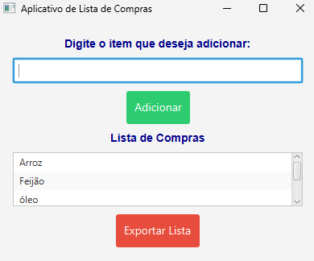

# Lista de Compras

## Descrição

Aplicativo de lista de compras com interface gráfica em JavaFX. Permite adicionar, exportar e carregar itens com uma estilização moderna e interativa.

## Funcionalidades

- Adicione itens à lista de compras.
- Visualize a lista de compras atual.
- Exporte a lista para um arquivo texto.
- Carregue a lista de compras previamente salva.

## Requisitos

- Java JDK 11 ou superior
- Eclipse IDE ou outra IDE Java com suporte a JavaFX

## Instruções de Uso

1. Clone o repositório:
    ```bash
    git clone https://github.com/HigorPereira10/ListaDeCompras.git
    ```

2. Abra o projeto na sua IDE.

3. Execute a classe `ListaDeCompras` como uma aplicação Java.

4. Adicione itens à lista, visualize-os e exporte a lista conforme necessário.

## Estrutura do Projeto

- `src/`: Código-fonte do projeto.
  - `com/higor/listadecompras/view/`: Contém a classe principal `ListaDeCompras`.
  - `com/higor/listadecompras/model/`: Contém a classe `ListaDeComprasModel`, responsável pela lógica de manipulação da lista.
- `ListaDeCompras/recursos/`: Contém a imagem da interface.
- `README.md`: Este arquivo.

## Interface



